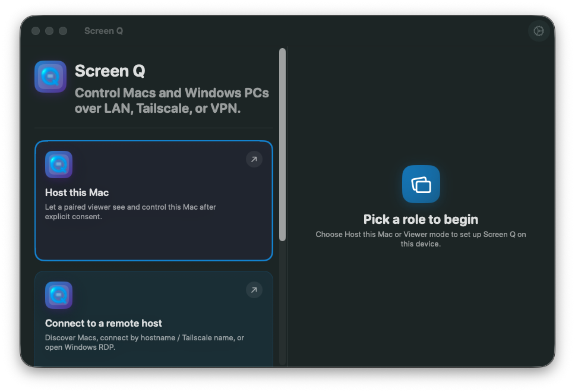

# Demo

This page tracks the public demo surface for Screen Q.

## Current Preview

The current macOS preview shows the role-based entry point and host setup
surface:

- choose **Host this Mac** to expose this Mac after explicit approval;
- choose **Connect to a remote host** to discover or manually connect to Macs
  and Windows PCs over LAN, Tailscale, or VPN;
- choose **Apple-native alternatives** when the task is better handled by
  FaceTime SharePlay Remote Control, iPhone Mirroring, Universal Control,
  Switch Control, or built-in Screen Sharing.

## Demo Script

1. Launch the macOS app.
2. Choose **Host this Mac**.
3. Grant Screen Recording, Accessibility, and Local Network permissions.
4. Start hosting and show the explicit viewer-permission controls.
5. Launch a viewer on another Mac, iPhone, or iPad on the same LAN or tailnet.
6. Enter the host pairing code.
7. Approve the request on the host before any frames or input flow.
8. Demonstrate fit/fill, keyboard input, pointer input, and disconnect.

## Safety Notes

- Do not publish screenshots that expose live pairing codes, hostnames, IP
  addresses, tailnet names, certificates, credentials, or local usernames.
- The public demo should show iPhone and iPad as viewers or Apple-native
  guidance surfaces, not as third-party remotely controllable hosts.
- RDP demos should show certificate review and trust boundaries before showing
  a Windows desktop.

## Pending Media

- Short macOS host setup walkthrough.
- Native pairing and approval flow.
- Viewer controls on iPad.
- RDP certificate review and connection flow.
